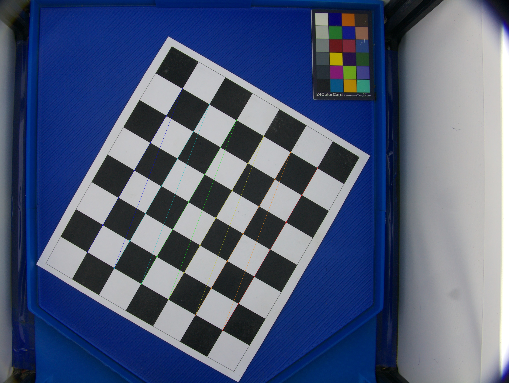

# Seeds_Pipeline

**Digital phenotyping pipeline for *Phaseolus* spp. seed characterisation**  
Alliance Bioversity International and CIAT — Bean Breeding Program, Palmira, Colombia

---

## Overview

Seeds_Pipeline is a modular Python-based image processing pipeline for the morphometric, colorimetric, and shape-based characterisation of *Phaseolus* seeds from images captured with the Phenobox system. It extracts over 37 quantitative descriptors per seed, computes pairwise similarity distances, and performs unsupervised hierarchical clustering to support genotype comparison and breeding decisions.

Each script is run manually in the numbered order shown below.

---

## Pipeline overview

```
Images (Phenobox)
       │
       ▼
01 → 02   Geometric correction (checkerboard calibration)
       │
03 → 04   Colorimetric correction (colour card)
       │
  05        Scale calibration
  06        AOI crop
  07        Mask exclusion
       │
  08 → 09   Morphometric analysis (37 descriptors + Haralick texture)
       │
10.0 → 10.1  Colour extraction (K-means) + EMD colour distances
       │
11.0 → 11.1 → 11.2   Shape analysis (GPA + EFA)
       │
  12        Shape distances (normalised Euclidean)
  13        Export dendrograms to JSON (D3.js)
  14        Integrated PCA + Ward clustering
  15        Seed counter (Watershed)
  16        Merge with field book
```

---

## Requirements

- Python 3.11+
- Windows (tested on Windows 10/11 with Miniconda)
- Conda environment or virtualenv recommended

### Dependencies

```
opencv-python
plantcv
numpy
pandas
scipy
scikit-image
scikit-learn
matplotlib
python-dotenv
tkinter  (included in standard Python)
```

Install with:

```bash
pip install -r requirements.txt
```

---

## Setup

### 1. Create trial folder structure

Run the batch file to create the full folder structure and `.env` file for a new trial:

```bash
crear_ensayo_seedPipeline.bat
```

This creates all required subfolders and a `.env` file with the `RUTA` variable pointing to your trial folder.

### 2. Configure `.env`

The `.env` file in the `scripts/` folder must define:

```
RUTA=D:/path/to/your/trial/folder
```

All scripts read this variable to locate input and output folders.

### 3. Place input images

| Folder | Content |
|---|---|
| `all/` | Original images from the Phenobox (JPG) |
| `calibracionCamara/ajedrez/` | Checkerboard calibration images |
| `calibracionCamara/colorCard/colorCard.jpg` | Single image of the colour card |
| `libroCampo/libroCampo.csv` | Field book CSV with `In_row` column |

---

## Running the pipeline

Run each script manually in numbered order from the `scripts/` folder:

```bash
python scripts/01_ObtenerParametros_Ajedrez.py
python scripts/02_DistorcionCorrection_Ajedrez.py
python scripts/03_ObtenerMascara_ColorCard.py
# ... and so on through script 16
```

Each script reads its inputs from the folders produced by the previous step and writes its outputs to the corresponding subfolder inside the trial folder.

---

## Scripts reference

### Geometric correction

#### `01_ObtenerParametros_Ajedrez.py`

- **Input:** `calibracionCamara/ajedrez/*.jpg`
- **Output:** `calibracionCamara/parametrosCorreccion/calibracion_params.npz`
- **Key parameters:** `GUARDAR_CHESSBOARD_CORNERS` (bool)

<!-- IMAGE: example checkerboard corner detection result -->


---

#### `02_DistorcionCorrection_Ajedrez.py`

- **Input:** `all/*.jpg`
- **Output:** `noDistorcion/`

<!-- IMAGE: before/after geometric correction comparison -->
<!--  -->

---

### Colorimetric correction

#### `03_ObtenerMascara_ColorCard.py`

- **Input:** `calibracionCamara/colorCard/colorCard.jpg`
- **Output:** `calibracionCamara/colorCard/colorCard_mask.png`
- **Key parameters:** `RADIUS` (patch detection radius, default 6); `POS` (card orientation: 1, 2 or 3, default 3)

<!-- IMAGE: detected colour card patches with mask overlay -->
<!--  -->

---

#### `04_ColorCorrection_ByMask.py`

- **Input:** `noDistorcion/` + `colorCard_mask.png`
- **Output:** `colorCorrejidas/`

<!-- IMAGE: before/after colorimetric correction comparison -->
<!--  -->

---

### Scale, AOI and mask

#### `05_ConocerEscalas.py`

- **Input:** Reference image
- **Output:** `calibracionCamara/factorEscala/factor_escala.json`
- **Notes:** Run interactively — click two points on the reference image and enter the real distance in mm.

<!-- IMAGE: scale calibration interface with measurement points -->
<!--  -->

---

#### `06_CutImagesApp.py`

- **Input:** `colorCorrejidas/`
- **Output:** `areaInteres/`
- **Notes:** Run interactively — draw the region of interest rectangle on the first corrected image; the crop is applied to the entire batch.

<!-- IMAGE: AOI selection rectangle on a corrected image -->
<!--  -->

---

#### `07_ApplyMaskApp.py`

- **Input:** `areaInteres/` or `colorCorrejidas/`
- **Output:** same folder (in-place)
- **Notes:** Run interactively — draw the exclusion mask rectangle (e.g. to cover the colour card).

<!-- IMAGE: exclusion mask applied over the colour card area -->
<!--  -->

---

### Morphometric analysis

#### `08_analisisMorfometria.py`

- **Input:** `areaInteres/`
- **Output:** `Morfometria/metricasCompletas.csv`; `Binarizadas/`; `Segmentadas/`; `Resultados/`
- **Key parameters:** `THRESHOLD` (Cr channel, default 127); `AREA_MIN` (200 px²); `AREA_MAX` (12000 px²); `ANCHO_MIN/MAX`; `LARGO_MIN/MAX`

<!-- IMAGE: segmented seeds with labelled morphometric measurements -->
<!--  -->

---

#### `09_summarizeMorfometria.py`

- **Input:** `Morfometria/metricasCompletas.csv`
- **Output:** `Morfometria/metricasCompletas_summary.csv`

<!-- IMAGE: summary table or boxplot of morphometric descriptors per genotype -->
<!--  -->

---

### Colorimetric analysis

#### `10.0_extraerColor_Kmeans.py`

- **Input:** `Segmentadas/`
- **Output:** `Colorimetria/analisis_colores.csv`
- **Key parameters:** `N_COLORS` (K dominant colours, default 2); `EROSION_ITERATIONS` (default 3); `KERNEL_SIZE` (default 7)

<!-- IMAGE: seed images with K-means dominant colour swatches -->
<!--  -->

---

#### `10.1_colorDistance.py`

- **Input:** `Colorimetria/analisis_colores.csv`
- **Output:** `colorDistance/distance_matrix_emd.csv`; heatmap and dendrogram PNG
- **Notes:** EMD computed in RGB space.

<!-- IMAGE: colour distance heatmap and dendrogram -->
<!--  -->

---

### Shape analysis

#### `11.0_filtrarBinarizadas.py`

- **Input:** `Binarizadas/`
- **Output:** `binarizadasFiltradas/`
- **Key parameters:** `AREA_MIN_F`; `AREA_MAX_F`; `ANCHO_MIN_F/MAX_F`; `LARGO_MIN_F/MAX_F`

<!-- IMAGE: grid of filtered binary seed masks -->
<!--  -->

---

#### `11.1_alinearFormas.py`

- **Input:** `binarizadasFiltradas/`
- **Output:** `binarizadasAlineadas/`
- **Key parameters:** `GRID_COLS` (visualisation grid columns, default 8)

<!-- IMAGE: grid of GPA-aligned seed contours -->
<!--  -->

---

#### `11.2_formaPromedio.py`

- **Input:** `binarizadasAlineadas/`
- **Output:** `formaPromedio/efa_coefficients_all_images.csv`; PNG visualisations
- **Key parameters:** `N_HARMONICS` (EFA harmonics, default 20); `N_POINTS` (contour points, default 128); `MIN_SOLIDITY` (default 0.90); `MIN_CIRCULARITY` (default 0.55)

<!-- IMAGE: mean seed shape reconstructed from EFA coefficients -->
<!--  -->

---

### Distances, clustering and integration

#### `12_formasDistance.py`

- **Input:** `formaPromedio/efa_coefficients_all_images.csv` + morphometry summary
- **Output:** `formasDistance/shapes_distance_matrix.csv`; heatmap and dendrogram PNG

<!-- IMAGE: shape distance heatmap and dendrogram -->
<!--  -->

---

#### `13_linkage2json.py`

- **Input:** colour and shape distance matrices
- **Output:** `dendrogramas/dendrogram_color.json`; `dendrogram_shapes.json`
- **Key parameters:** `LINKAGE_METHOD` (default `'average'`)

<!-- IMAGE: D3.js interactive dendrogram screenshot (colour and shape) -->
<!--  -->

---

#### `14_clusterFormasFormayMorfometríaIntegradaIntegrada.py`

- **Input:** EFA coefficients + morphometry summary
- **Output:** `clusterIntegrado/` (PCA plots, cluster assignments)
- **Key parameters:** `MAX_CLUSTERS` (default 6); `N_COMPONENTS` (max PCA components, default 10)

<!-- IMAGE: PCA biplot with Ward cluster assignments coloured by genotype -->
<!--  -->

---

### Seed counting and field book merge

#### `15_contadorSemillas.py`

- **Input:** `areaInteres/`
- **Output:** `conteo/reporte_YYYYMMDD_HHMMSS.csv`
- **Key parameters:** `THRESHOLD_VAL` (Cr channel, default 125); `MIN_DISTANCE` (px between seeds, default 10); `PEAK_THRESHOLD` (Watershed fraction, default 0.20)

<!-- IMAGE: Watershed seed count result with labelled seed centroids -->
<!--  -->

---

#### `16_unirDatosconLibroCampo.py`

- **Input:** morphometry + colour + shape + conteo CSVs + `libroCampo/libroCampo.csv`
- **Output:** `resultadosUnidos/metricasCompletasSemillas_*.csv`
- **Notes:** Key normalisation: `in_row=1224.jpg` → `1224`; `_2`/`-2` suffixes treated as photo replicates.

<!-- IMAGE: screenshot of the final merged output table -->
<!--  -->

---

## Folder structure

```
TRIAL_FOLDER/
├── all/                          ← original images
├── calibracionCamara/
│   ├── ajedrez/                  ← checkerboard images
│   ├── colorCard/                ← colour card image and mask
│   ├── factorEscala/             ← factor_escala.json
│   └── parametrosCorreccion/     ← calibracion_params.npz
├── noDistorcion/                 ← after geometric correction
├── colorCorrejidas/              ← after colorimetric correction
├── areaInteres/                  ← after AOI crop
├── Binarizadas/                  ← binary segmentation masks
├── binarizadasFiltradas/         ← filtered binary masks
├── binarizadasAlineadas/         ← GPA-aligned contours
├── Segmentadas/                  ← seed-on-white segmented images
├── Resultados/                   ← annotated result images
├── Morfometria/
│   ├── metricasCompletas.csv
│   └── metricasCompletas_summary.csv
├── Colorimetria/
│   └── analisis_colores.csv
├── colorDistance/
│   └── distance_matrix_emd.csv
├── formaPromedio/
│   └── efa_coefficients_all_images.csv
├── formasDistance/
│   └── shapes_distance_matrix.csv
├── dendrogramas/
│   ├── dendrogram_color.json
│   └── dendrogram_shapes.json
├── clusterIntegrado/
├── conteo/
├── libroCampo/
│   └── libroCampo.csv
└── resultadosUnidos/
    └── metricasCompletasSemillas_TRIAL_YYYYMMDD.csv
```

---

## Key output variables

### Morphometry (`metricasCompletas.csv`)

`Area`, `Perimeter`, `Width`, `Length`, `AR`, `Circ`, `Solid`, `Caliper`, `Theta`, `Eccentricity`, `Form_factor`, `Narrow_factor`, `Rectangularity`, `PD_ratio`, `PLW_ratio`, `Convexity`, `Elongation`, `Haralick_Circ`, `Norm_Circ`, `Radius_min/mean/max`, `Diameter_min/mean/max`, `Radius_ratio`, `Major_axis`, `Minor_axis`, `Area_CH`, `Centroid_X/Y`, `ASM`, `Contrast`, `Correlation`, `Variance` (dissimilarity), `IDM` (linear homogeneity), `Energy`, `Entropy`

### Colorimetry (`analisis_colores.csv`)

`RGB1`, `RGB2`, `Hex1`, `Hex2`, `%1`, `%2`, `L1`, `L2` (luminance), `LAB1`, `LAB2`

### Shape (`efa_coefficients_all_images.csv`)

`H1_A … H20_D` — 80 normalised EFA coefficients (4 per harmonic × 20 harmonics), invariant to orientation and starting point

---

## Notes on image naming

Scripts 10.1 and 12 expect images named as `in_row=NNNN.jpg` or `in_row=NNNN_2.jpg`. Script 16 normalises these automatically:

- `in_row=1224.jpg` → key `1224`
- `in_row=1234_2.jpg` or `in_row=1234-2.jpg` → photo replicate of `1234`, excluded from morphometry and colour but **summed** in seed counts

---

## Citation

If you use this pipeline in your research, please cite:

> Alliance Bioversity International and CIAT — Bean Breeding Program (2025). *Seeds_Pipeline: A modular Python pipeline for digital phenotyping of Phaseolus spp. seeds*. Palmira, Colombia.

Relevant methodological references:

- Berry, J. C., Fahlgren, N., Pokorny, A. A., Bart, R. S., & Veley, K. M. (2018). An automated, high-throughput method for standardizing image color profiles to improve image-based plant phenotyping. *PeerJ*, 6, e5727. https://doi.org/10.7717/peerj.5727
- Dayrell, R. L. C., Ott, T., Horrocks, T., & Poschlod, P. (2023). Automated extraction of seed morphological traits from images. *Methods in Ecology and Evolution*, 14(7), 1708–1718. https://doi.org/10.1111/2041-210X.14127
- Kim, B.-H. (2024). Leveraging image analysis for high-throughput phenotyping of legume plants. *Legume Research — An International Journal*. https://doi.org/10.18805/LRF-806
- Liu, F., Yang, R., Chen, R., Lamine Guindo, M., He, Y., Zhou, J., Lu, X., Chen, M., Yang, Y., & Kong, W. (2024). Digital techniques and trends for seed phenotyping using optical sensors. *Journal of Advanced Research*, 63, 1–16. https://doi.org/10.1016/j.jare.2023.11.010
- Morales, M. A., Worral, H., Piche, L., Adeniyi, A. S., Dariva, F., Ramos, C., Hoang, K., Yan, C., Flores, P., & Bandillo, N. (2024). *High-throughput phenotyping of seed quality traits using imaging and deep learning in dry pea* (p. 2024.03.05.583564). bioRxiv. https://doi.org/10.1101/2024.03.05.583564
- Rubner, Y., Tomasi, C., & Guibas, L. J. (2000). The Earth Mover's Distance as a metric for image retrieval. *International Journal of Computer Vision*, 40(2), 99–121. https://doi.org/10.1023/A:1026543900054
- Varga, F., Vidak, M., Ivanović, K., Lazarević, B., Širić, I., Srečec, S., Šatović, Z., & Carović-Stanko, K. (2019). How does computer vision compare to standard colorimeter in assessing the seed coat color of common bean (*Phaseolus vulgaris* L.)? *Journal of Central European Agriculture*, 20(4), 1169–1178. https://doi.org/10.5513/JCEA01/20.4.2509
- Ward, J. H. (1963). Hierarchical grouping to optimize an objective function. *Journal of the American Statistical Association*, 58(301), 236–244. https://doi.org/10.1080/01621459.1963.10500845
- Zhang, Z. (2000). A flexible new technique for camera calibration. *IEEE Transactions on Pattern Analysis and Machine Intelligence*. https://doi.org/10.1109/34.888718

---

## License

This project is developed for internal research use at Alliance Bioversity International and CIAT. Contact the Bean Breeding Program for collaboration inquiries.
